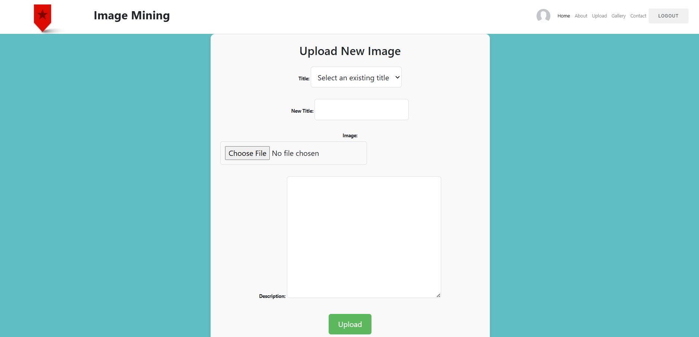
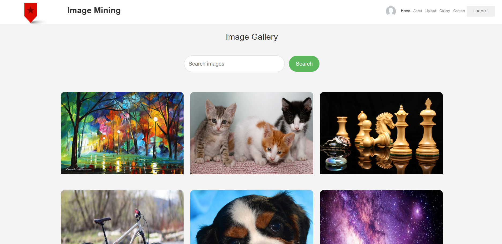
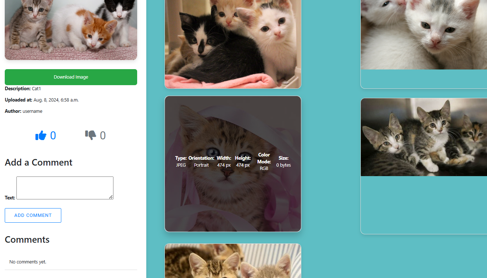
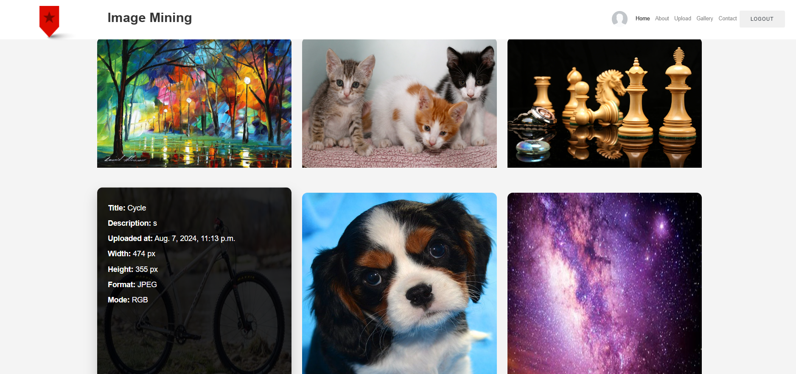
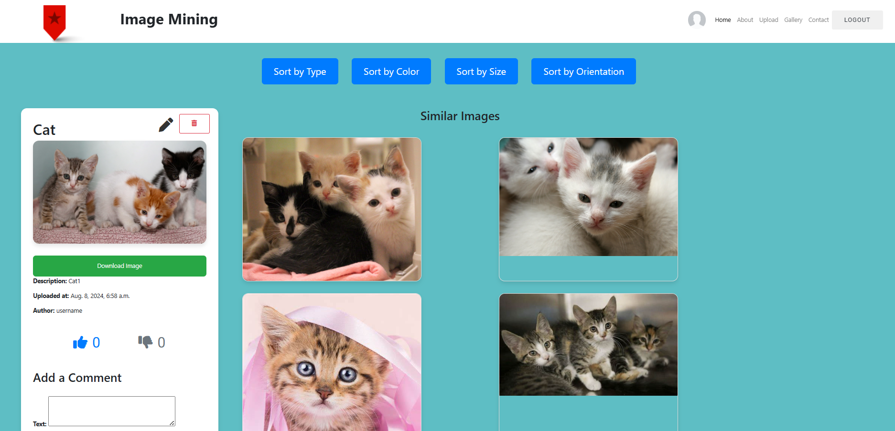
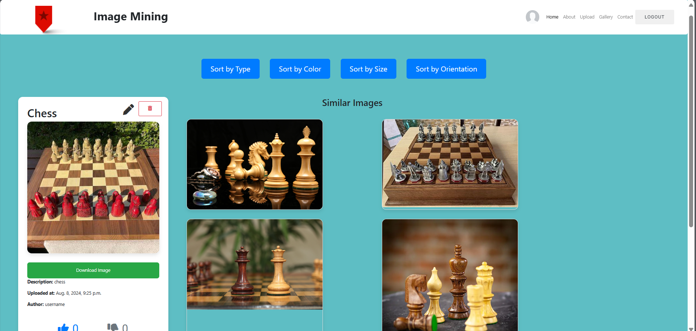
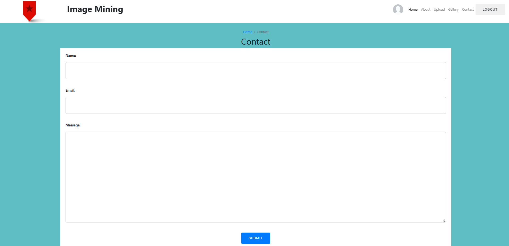
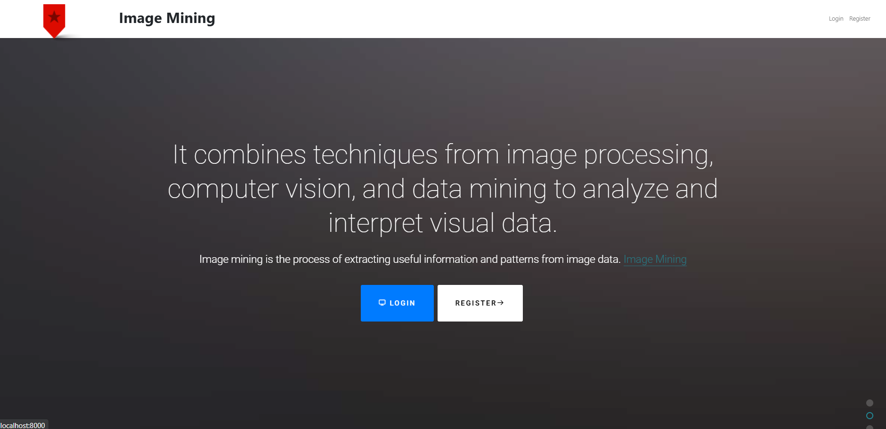

# Django Image Gallery

This project is a web-based image gallery built with Django, allowing users to upload images, create albums, add comments and likes, and sort images based on different criteria. The application also features similar image recommendations and hover effects to display image descriptions.

## Features

### 1. Image Upload & Album Creation
Users can create albums and upload images into specific albums. The form for creating albums and uploading images is user-friendly and provides options for managing image data.

- **Screenshot**:  
  

### 2. Image Gallery
A gallery view displays all the uploaded images, categorized into different albums. Users can navigate through images easily and explore various albums.

- **Screenshot**:  
  

### 3. Like, Comment, & Interaction
Users can like and comment on images. This feature encourages interaction and engagement with the gallery.

- **Screenshot**:  
  

### 4. Image Hover Effects
When hovering over an image, additional information such as the image description is displayed. This effect enhances the user experience by providing context without cluttering the interface.

- **Screenshot**:  
  

### 5. Similar Image Recommendations
The application provides image recommendations based on the current image being viewed, showing visually or contextually similar images to the user.

- **Screenshot**:  
  

### 6. Sorting Images
Users can sort images based on various properties such as image type, color, size, and orientation. This allows for an organized view of the gallery and helps users find specific images quickly.

- **Screenshot**:  
  

### 7. Contact Page
A simple contact page is available where users can get in touch with the website owner or the gallery administrator for inquiries or feedback.

- **Screenshot**:  
  

### 8. Homepage
The homepage provides an overview of the gallery, albums, and options to interact with the application.

- **Screenshot**:  
  

## Installation

To run this project locally, follow the steps below:

1. **Clone the repository:**

   ```bash
   git clone <repository-url>
   ```

2. **Install the required dependencies:**

   ```bash
   pip install -r requirements.txt
   ```

3. **Run the Django development server:**

   ```bash
   python manage.py runserver
   ```

4. **Access the application:**
   
   Open your browser and go to `http://127.0.0.1:8000/` to access the gallery.

## Usage

- **Create Albums:** Users can create new albums and upload images directly to them.
- **Interact with Images:** Users can view images, leave likes, comments, and explore related images.
- **Sort Images:** Users can filter and sort images based on type, color, size, or orientation for easier navigation.
- **Hover Effects:** Hovering over images reveals additional descriptions without leaving the gallery view.

## Technologies Used

- **Django** for backend and web framework
- **SQLite** for database management
- **HTML/CSS/JavaScript** for frontend development
- **Bootstrap** for responsive design and styling

## Screenshots

- **Add Like & Comment**  
  

- **Contact Page**  
  

- **Create Album & Upload Image**  
  

- **Image Gallery**  
  

- **Homepage**  
  

- **On Hover Image Description**  
  

- **Similar Image Recommendations**  
  

- **Sort by Type, Color, Size, Orientation**  
  

